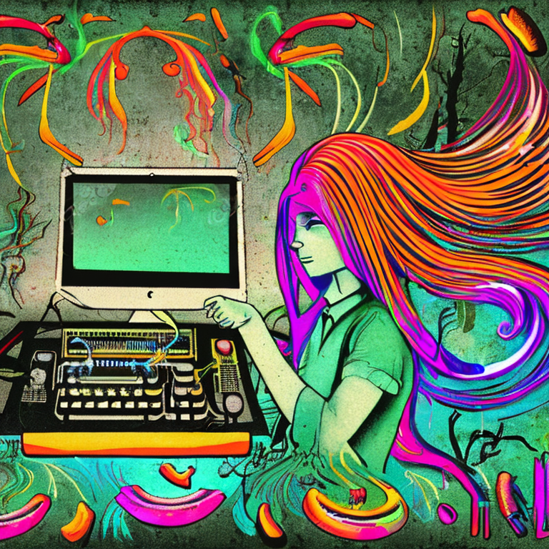
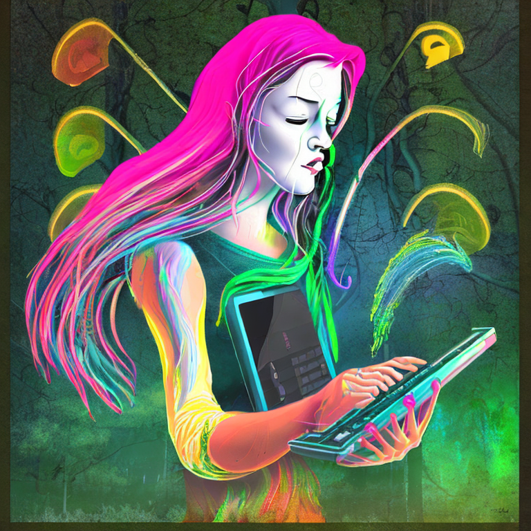
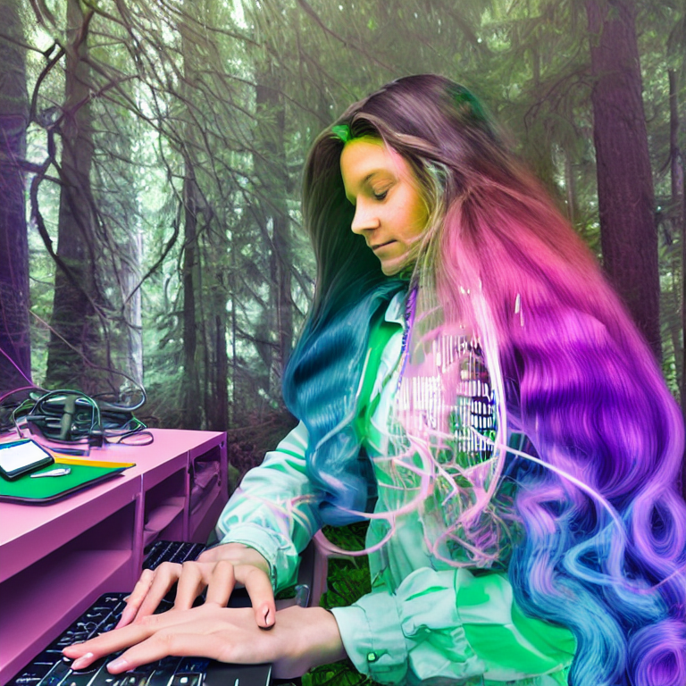
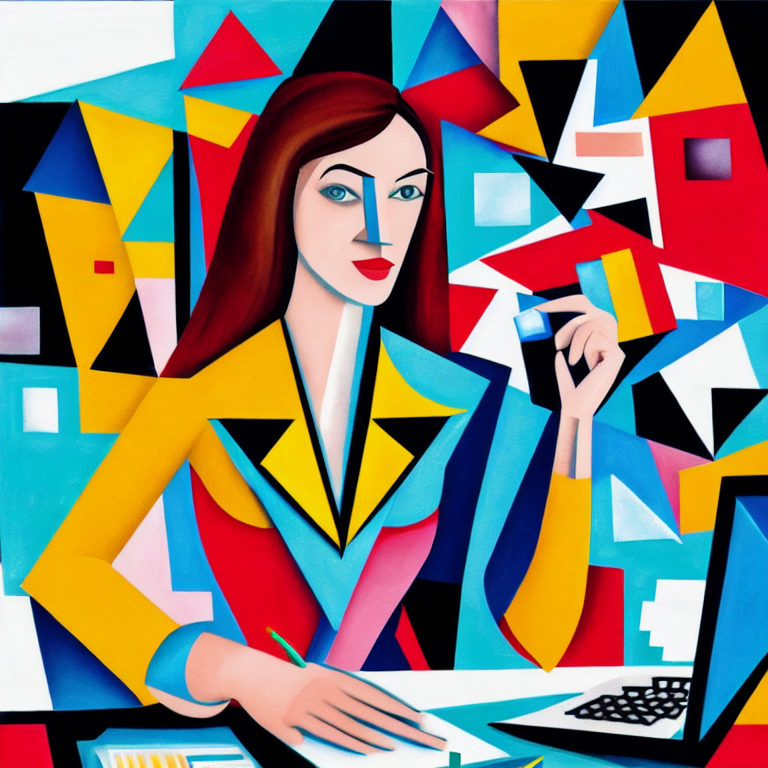
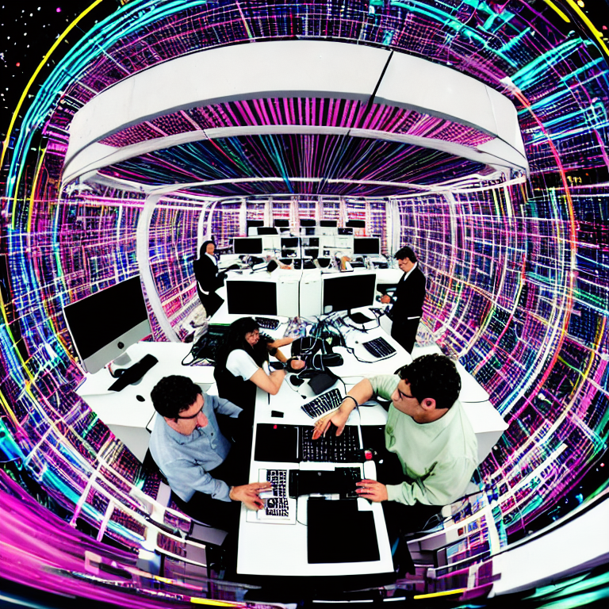
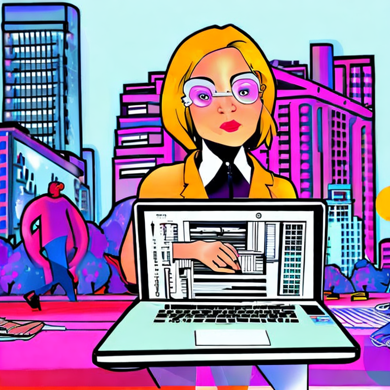
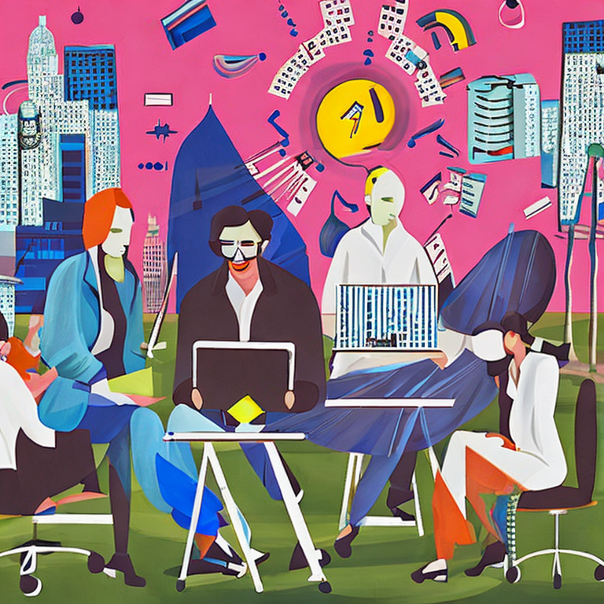
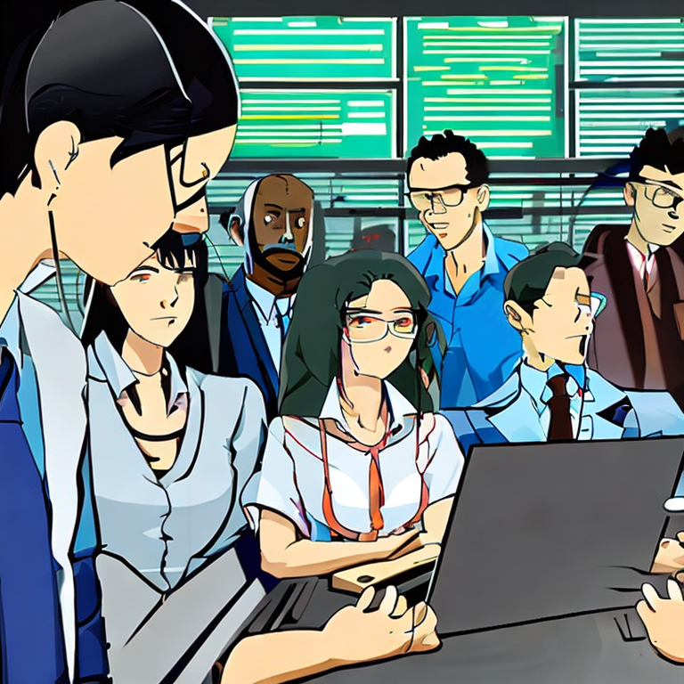
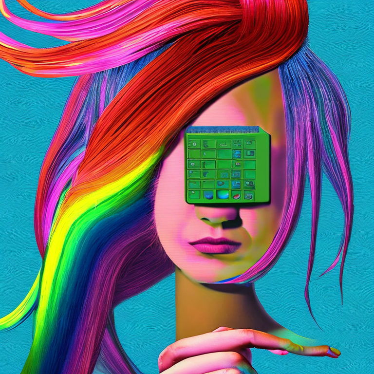

# Digital Art

Model: stabilityai/stable-diffusion-2-1
```
a grunge technogaianist with long rainbow hair 
pointing to a computer in the forest, 
technology and nature swirling in harmony, 
vines becoming patch cables, plugging vines into the computer, 
trees swaying to the beat, 
postmodern surrealist concert poster
```


---
Model: stabilityai/stable-diffusion-2-1

```
a grunge technogaianist with long rainbow hair 
pointing to a computer in the forest, 
technology and nature swirling in harmony, 
vines becoming patch cables, plugging vines into the computer, 
trees swaying to the beat, 
science fiction movie poster
```


---
Model: dreamlike-art/dreamlike-photoreal-2.0
```
a savvy feminine technologist with long colorful hair 
working on a mobile computer in the forest, 
technology and nature swirling in harmony, 
trees swaying to the beat, 
postmodern surrealist concert poster
```



---
Model: dreamlike-art/dreamlike-photoreal-2.0
```
a modern business woman working at a computer surrounded by data
```


---
Model: dreamlike-art/dreamlike-photoreal-2.0
```
a modern business woman working at a computer surrounded by data as a cubist painting
```



---
Model: dreamlike-art/dreamlike-photoreal-2.0
```
a modern business woman working at a computer surrounded by data as a blockbuster movie poster
```


---
Model: dreamlike-art/dreamlike-photoreal-2.0
```
a multi-national 3 person technology team working at a computer surrounded by data as a movie poster
```


---
Model: dreamlike-art/dreamlike-photoreal-2.0
```
a technology team of a man and a woman working at a computer surrounded by data as a postmodern surrealist concert poster
```



---
Model: stabilityai/stable-diffusion-2-1

```
a savvy feminine technologist
working on a mobile computer in the middle of city park, 
lights representing technology and data streaming around her, 
in the style of a pop art poster
```


---
Model: stabilityai/stable-diffusion-2-1

```
a group of savvy feminine technologists
working on a mobile computer in the middle of city park, 
lights representing technology and data streaming around her, 
in the style of a dada art poster
```


---
Model: stabilityai/stable-diffusion-2-1

```
a group of savvy masculine and feminine technologists 
working on a mobile computer in the middle of city park
surrounded by data
in the style of a Salvador Dali painting
```


---
Model: stabilityai/stable-diffusion-2-1

```
a group of savvy masculine and feminine technologists 
in a heated discussion 
surrounded by data
in the style of anime
```


---
Model: stabilityai/stable-diffusion-2-1

```
a postmodern computer with data flowing out of into the long rainbow hair of a technogaianist as a surrealist painting
```
